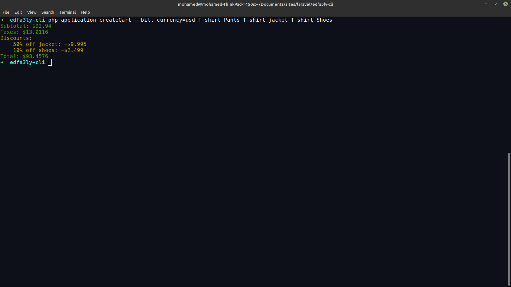
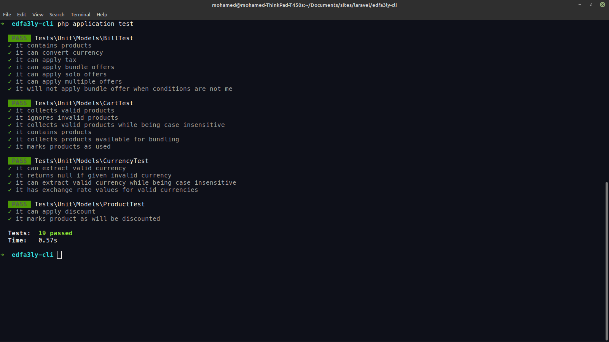

<h3>Edfa3ly-CLI</h3>
The project is simple, it consists of 4 models:

- Product
- Cart
- Currency
- Bill

---

<h4>How things are wired?</h3>

- A CLI command will try to capture the user input, which is a currency and an array of products.
- If the input is valid, we will create a Currency object and Product(s) Object(s).
- The products are contained within a cart.
- We initiate creating the Bill process, which a sort of pipeline of processes:
    - Convert the currency of the bill if a non-default currency was used.
    - Apply taxes.
    - Apply offers (solo offers & bundle offers)
- The CLI will print the Bill

---

<h4>Requirements</h4>

- Composer
- PHP >= 7.4

---

<h4>Installation & Usage</h4>

- To install the dependencies run: composer install

- available products are (case insensitive): t-shirt, shoes, jacket and pants
- available currencies are (case insensitive): usd & egp

- To run the app run: php application createCart --bill-currency=usd T-shirt Pants T-shirt jacket T-shirt Shoes

- To test the app run: php application test

---

<h4>This task was built using Laravel Zero</h4>

    

## Documentation

For full documentation, visit [laravel-zero.com](https://laravel-zero.com/).
